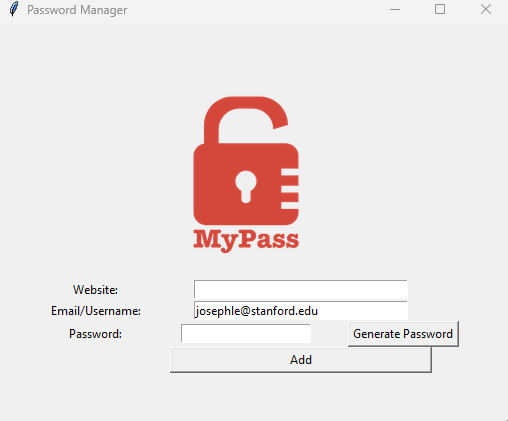

# GUI Password Manager

This is a graphical user interface (GUI) password manager that allows users to generate strong random passwords, store them securely in a local JSON file, and retrieve existing passwords by searching with a website name.

## Features

1. **Generate Strong Passwords**: 
   - Creates random passwords consisting of letters, numbers, and symbols.
   - Automatically copies the generated password to the clipboard.

2. **Store Passwords Locally**:
   - Saves website name, email/username, and password in a local `data.json` file.
   - Automatically updates the file if the website already exists.

3. **Search for Saved Passwords**:
   - Allows searching for an existing password using the website name.
   - Displays the email/username and password in a pop-up window.

## Tools Used

- **Tkinter**: For building the graphical user interface.
- **JSON**: For storing and retrieving password data.
- **Pyperclip**: For copying passwords to the clipboard.

## How to Use

1. **Add a Password**:
   - Enter the website name, email/username, and password.
   - Click the "Add" button to save the details to the local JSON file.

2. **Generate a Password**:
   - Click the "Generate Password" button to create a strong random password.
   - The password will be automatically copied to the clipboard.

3. **Search for a Password**:
   - Enter the website name and click the "Search" button.
   - If the website exists in the JSON file, the email/username and password will be displayed in a pop-up window.

## Screenshots



## Requirements

- Python 3.x
- Required libraries:
  - `tkinter` (pre-installed with Python)
  - `pyperclip`

## Installation

1. Clone the repository:
   ```bash
   git clone https://github.com/yourusername/gui-password-manager.git
   ```

2. Navigate to the project directory:
   ```bash
   cd gui-password-manager
   ```

3. Install the required library:
   ```bash
   pip install pyperclip
   ```

4. Run the application:
   ```bash
   python main.py
   ```

## File Structure

- `main.py`: The main Python script containing the password manager logic.
- `data.json`: A JSON file where passwords are stored (created automatically if it doesn't exist).
- `logo.png`: The logo displayed in the GUI.

## Notes

- Ensure the `data.json` file is stored securely and not shared.
- If no data file exists or it is empty, the application will create a new one when a password is saved.

## License

This project is licensed under the MIT License. See the `LICENSE` file for details.
